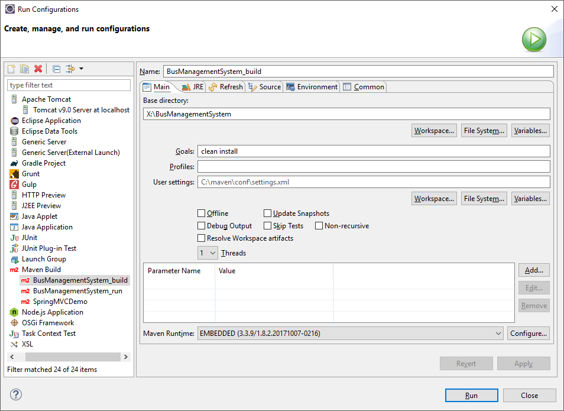
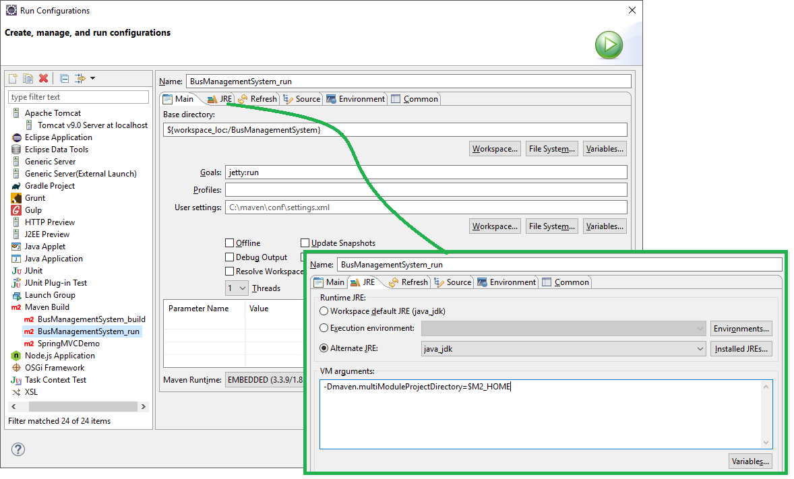

# Bus Management System

This is a simple maven project with Jetty Server

Compile using: `mvn clean install`     
Run using: `mvn jetty:run`     
Home page: [http://localhost:8080/BusManagementSystem/](http://localhost:8080/BusManagementSystem/)

Setup
------

Download Java [JDK](https://download.oracle.com/otn-pub/java/jdk/8u201-b09/42970487e3af4f5aa5bca3f542482c60/jdk-8u201-windows-x64.exe) and extract the exe to `c:\jdk`   
 
Download [Maven](https://www-us.apache.org/dist/maven/maven-3/3.6.0/binaries/apache-maven-3.6.0-bin.zip) and extract to `c:\maven` 

**Set Environment variables**:   
1. JAVA_HOME `c:\jdk`
2. M2_HOME `c:\maven`
3. Add `C:\maven\bin` and `C:\jdk\bin` to the begining of PATH variable

**Set Maven in Eclipse**:
      
Go to Windows --> Preferences --> Maven --> Installations --> Add    
Browse to `C:\maven` and press Finish      
select the newly added maven instllation and hit Apply and close     

Now go to Windows --> Preferences --> Maven --> User Settings    
Set the User Settings to `C:\maven\conf\settings.xml`     
Hit Update Settings, Reindex and Apply and Close.   

Create Run Config in Eclipse
----------------------------

**Build Config**

   

**Run Config**

   
